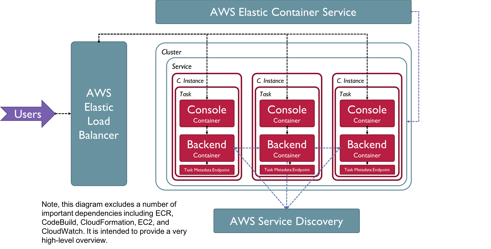

# BuilderSession
## Introduction
A set of containers to automatically consume resources for a builder session on analyzing your ECS workloads. The project helps to setup an initial service that can use an API to consume resources on the backing host. Requests can specify the resource consumption for either a single host (as specified by the Elastic Load Balancer) or for all of the hosts as they communicate via Service Discovery.

## Setup
To setup the service in your ECS account, you merely perform a few simple steps. The estimated setup time is approximately 10 minutes.

1. **Provide CodeBuild with Permissions.**
    * Navigate to the CodeBuild console in your region of choice.
    * Select "Create Project" and navigate to the "Source" section.
    * Type in this Repository information and provide CodeBuild access to your GitHub credentials.
2. **Setup your Cloudformation stack.**
    * Navigate to the Cloudformation console in your region of choice. Click CreateStack.
    * Copy the Cloudformation template from ConsumerInfrastructure into the template definition.
    * Choose your parameters, but keep DesiredCount of Tasks set to 0 for the moment.
    * Click Create and wait for the stack to start up and complete its update.
3. **Build your images in CodeBuild.**
    * Navigate to the CodeBuild console and to your Projects section in your region of choice.
    * Start Build for both your Console and Backend projects that were created by Cloudformation.
    * Wait for the build to complete successfully.
4. **Start your containers.**
    * Navigate to the ECS console and to your Service created by Cloudformation in your region of choice.
    * Update the Service to your specified Desired Count to start Tasks.
    * Wait for the Service to finish updating.
5. **Connect to your endpoint for requests.**
    * Navigate to the EC2 console and to the Load Balancer section in your region of choice.
    * Find the LoadBalancer referenced in your Cloudformation stack and copy the Public DNS Name into a separate browser window.
    * Hit enter. You should see a simple console for inputting an API request.
6. **Make a request.**
    * Input the data you would like to send in your request.
    * Note that if the request is invalid you may see errors.
    * Leaving all of the fields empty will result in a simple read of all the live Tasks.
